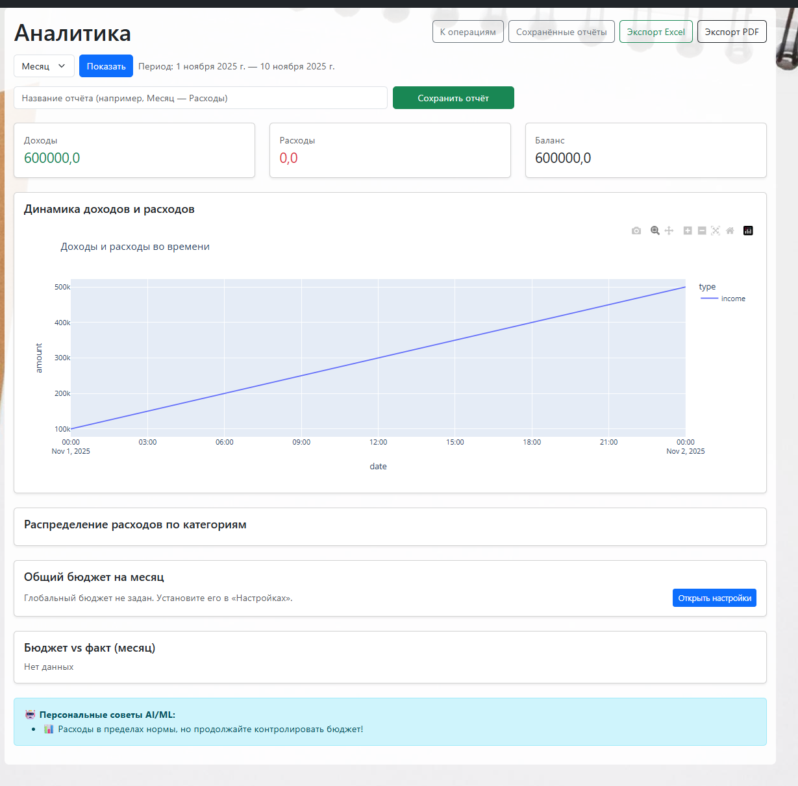
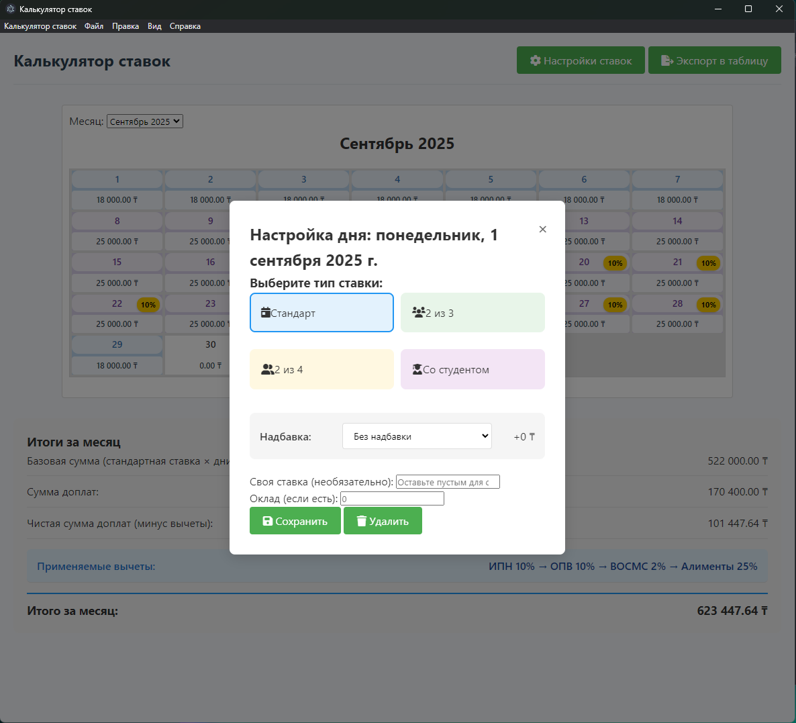
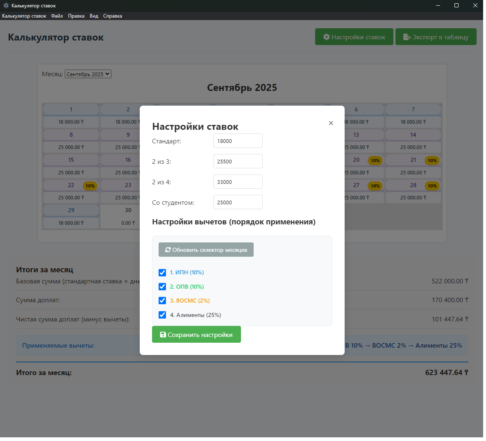
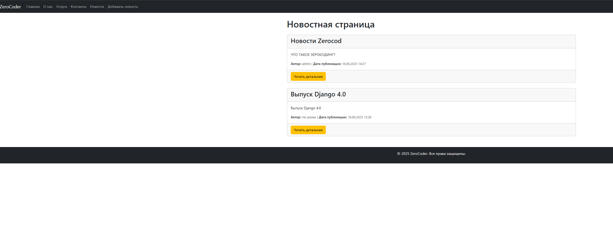
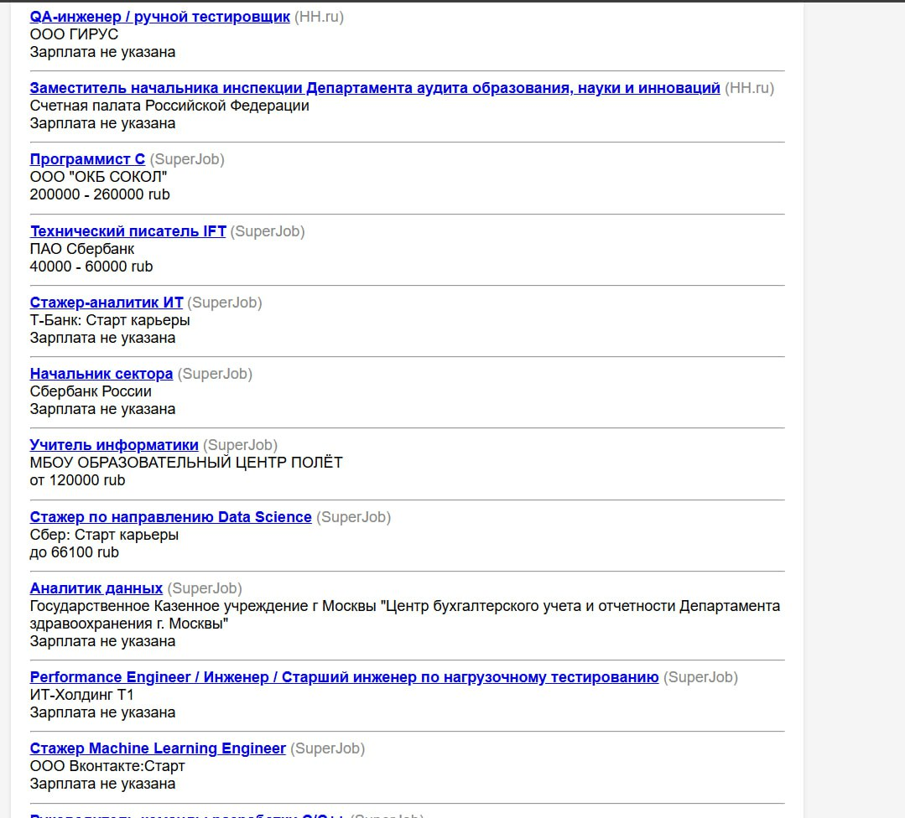
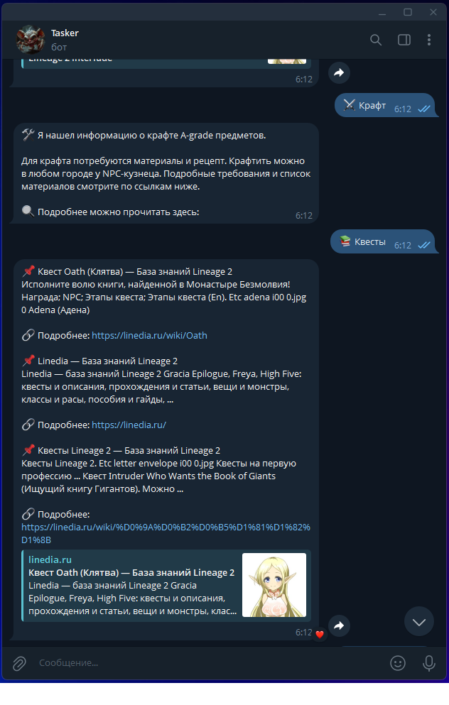
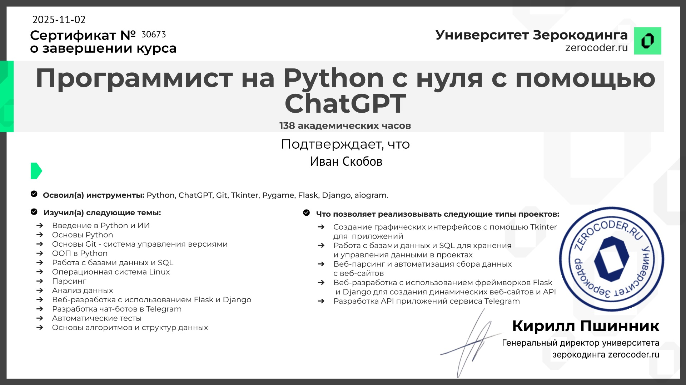
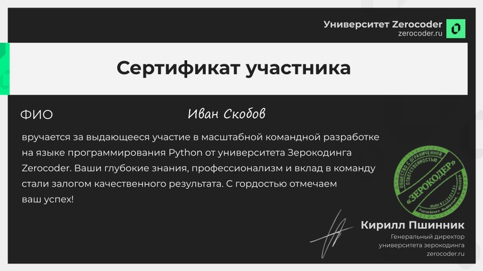

<!-- Автогенерация: не редактируйте вручную. Источник: templates/readme_template.md.j2 -->

# Портфолио — Иван Скобов

  
  
  
  <h3>Python Developer (Junior)</h3>
  
Самара, Готов к удалёнке

  

    <a href="https://github.com/IvanSkobov">GitHub</a>
     • <a href="https://t.me/i5second">Telegram</a>
     • <a href="mailto:5secondvano@gmail.com">5secondvano@gmail.com</a>
  

---

## Избранные проекты

<!-- Карточки проектов -->

  
<strong>FINCONTROL — сервис учёта личных финансов</strong> — <em>Django, aiogram</em>

  
  
  

  
  
Доходы/расходы, категории, бюджеты, аналитика, экспорт, уведомления; веб + Telegram-бот.

  

  

    🔗 <a href="https://github.com/IvanSkobov/Fincontrol">Репозиторий</a>
  

  
  

    
Показать ещё скриншоты

    
    
    
  

  

---

  
<strong>Приложения для расчёта зарплаты</strong> — <em>JavaScript, CSS, HTML, Batchfile</em>

  
  
  

  
  
Поддержка команд/inline-кнопок, хранение и статистика расчётов, экспорт в Excel.

  

  

    🔗 <a href="https://github.com/IvanSkobov/Work_Calc_time">Репозиторий</a>
  

  
  

    
Показать ещё скриншоты

    
    
    
  

  

---

  
<strong>Веб-сайт на Flask с базой данных</strong> — <em>Flask, SQLite, Bootstrap, FullCalendar</em>

  
  
  

  
  
Категории и карточки ссылок, добавление/редактирование через веб.

  

  

    🔗 <a href="https://github.com/IvanSkobov/WebDG_Project">Репозиторий</a>
  

  
  

    
Показать ещё скриншоты

    
    
    
  

  

---

  
<strong>2D-игра (Pygame)</strong> — <em>Pygame</em>

  
  
  

  
  
Уровни, коллизии, победа/поражение; структура: player.py, level.py, game.py, main.py.

  

  

    🔗 <a href="https://github.com/IvanSkobov/2D-platform">Репозиторий</a>
  

  
  

    
Показать ещё скриншоты

    
    
    
  

  

---

  
<strong>Парсер вакансий</strong> — <em>Requests, BeautifulSoup, SQLite, CSV</em>

  
  
  

  
  
Парсинг вакансий, сохранение в SQLite, экспорт в CSV.

  

  

    🔗 <a href="https://github.com/IvanSkobov/job-parser-system">Репозиторий</a>
  

  
  

    
Показать ещё скриншоты

    
    
    
  

  

---

  
<strong>Телеграм-бот Lineage-2 справка</strong> — <em>python-telegram-bot 20.7, SQLite</em>

  
  
  

  
  
Кэширование результатов, логирование, хранение данных в SQLite.

  

  

    🔗 <a href="https://github.com/IvanSkobov/telegram_ai_bot">Репозиторий</a>
  

  
  

    
Показать ещё скриншоты

    
    
    
  

  

---

## Сертификаты

<table>
  <tr>
  
    <td align="center" style="padding: 8px;">
      
      <a href="https://zerocoder.ru">
         
        Программист на Python с нуля с помощью ChatGPT
      </a>
      
       Университет Зерокодинга Zerocoder
       2025-11-02
    </td>
    
  
    <td align="center" style="padding: 8px;">
      
      <a href="https://zerocoder.ru">
         
        Сертификат участника — Выдающееся участие в командной разработке
      </a>
      
       Университет Zerocoder
       2024
    </td>
    
  
    <td align="center" style="padding: 8px;">
      
      <a href="https://zerocoder.ru">
         
        Сертификат участника — Успешное участие в командной разработке
      </a>
      
       Университет Zerocoder
       2024
    </td>
    
  </tr><tr>
    
  
  </tr>
</table>

---

Обновлено: 2025-11-11 08:48 UTC

